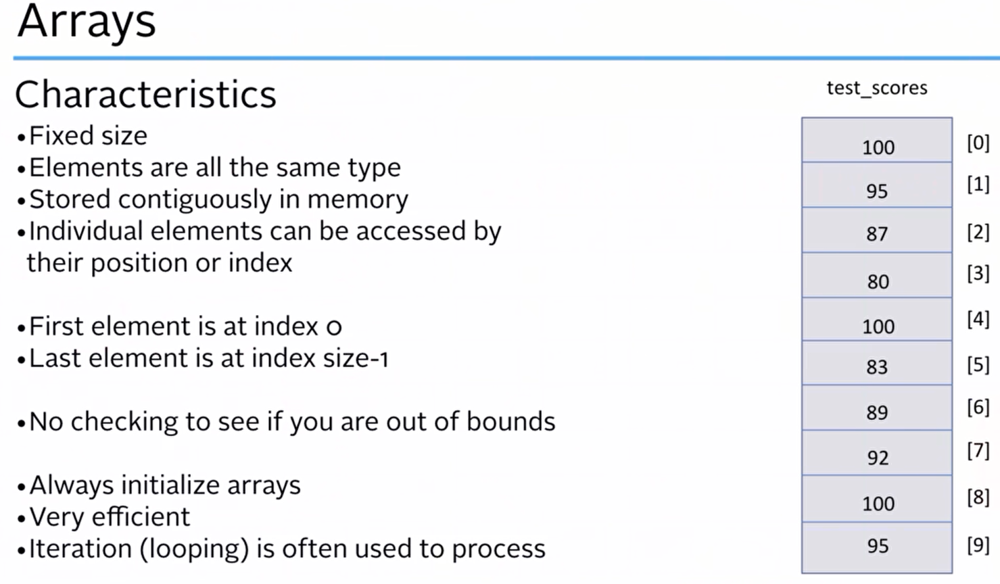

- [[#Arrays|Arrays]]
- [[#Multi dimensional array|Multi dimensional array]]
- [[#Vector|Vector]]
- [[#2D Vector|2D Vector]]

---

## Arrays




An array is a compound data type that consists of a collection of elements of the same type.\
Each element can be accessed by directly.

```cpp
 [[include]] <iostream>
int main()
{
 int prime[5]{}; // hold the first 5 prime numbers , declraing
 prime[0] = 2; // The first element has index 0
 prime[1] = 3;
 prime[2] = 5;
 prime[3] = 7;
 prime[4] = 11; // The last element has index 4 (array length-1)
 std::cout << "The lowest prime number is: " << prime[0] << '\n';
 std::cout << "The sum of the first 5 primes is: " << prime[0] + prime[1] + prime[2] + prime[3] + prime[4] << '\n';
 int composite[5] {4,6,8,9,10}; // initializing the array
 std::cout << "The first element is " << composite[0] << '\n';
 std::cout << "The sum of the composite is " << composite[0] + composite[1] + composite[2] + composite[3] + composite[4] << '\n';
 return 0;
}
```

> [!Output]
> The lowest prime number is: 2
> The sum of the first 5 primes is: 28
> The first element is 4
> The sum of the composite is 37


```cpp
[[include]] <iostream>
int main ()
{
 int score[10] {3,5}; //init to 3,5 and remaining 0
 std::cin >> score[5];
 score[6] = 32;
 std::cout << score[0] << " " << score[1] << " " << score[2] << " " << score[3] << " " << score[4] << " " << score[5] << " " << score[6] << " " << score[7] << " " << score[8] << " " << score[9] << std::endl;
 const int slices {6};
 int pizza[slices] {0}; //init all to 0
 std::cout << pizza[0] << " " << pizza[1] << " " << pizza[2] << " " << pizza[3] << " " << pizza[4] << " " << pizza[5] << std::endl; // accessing array
 // character changes to int
 int charArray[] {'a','b','c','d','e','f','g','h','i','j'}; //size automatically calculated
 std::cout << charArray[0] << " " << charArray[1] << " " << charArray[2] << " " << charArray[3] << " " << charArray[4] << " " << charArray[5] << " " << charArray[6] << " " << charArray[7] << " " << charArray[8] << " " << charArray[9] << std::endl;
 return 0;
}
```
> [!Output]
> 77         -> input
> 3 5 0 0 0 77 32 0 0 0
> 0 0 0 0 0 0
> 97 98 99 100 101 102 103 104 105 106


```cpp
[[include]] <iostream>
using std::cout;
using std::cin;
using std::endl;
int main ()
{
 char vowels[5] = {'a', 'e', 'i', 'o', 'u'};
 cout << "The vowels are: " << vowels[0] << ", " << vowels[1] << ", " << vowels[2] << ", " << vowels[3] << ", " << vowels[4] << endl;
 //* cin >> vowels[6]; // error: array subscript out of range
 int nums[3];
 cout << "The numbers are (garbage value): " << nums[0] << ", " << nums[1] << ", " << nums[2] << endl; // These are garbage values bcz we didn't initilize nums
 return 0;
}
```
> [!Output]
> The vowels are: a, e, i, o, u
> The numbers are (garbage value) : 6422476, 1979374800, 430125534


## Multi dimensional array

```cpp
%%cu
[[include]] <iostream>
using namespace std;
int main ()
{
 // Multi dimensional array
 int a[2][3] { {0, 1, 2}, {3, 4, 5} };
 cout << "a[0][0] = " << a[0][0] << endl << "a[0][1] = " << a[0][1] << endl << "a[0][2] = " << a[0][2] << endl;
 cout << "a[1][0] = " << a[1][0] << endl << "a[1][1] = " << a[1][1] << endl << "a[1][2] = " << a[1][2] << endl;
}
```

> [!Output]
> a[0][0] = 0
> a[0][1] = 1
> a[0][2] = 2
> a[1][0] = 3
> a[1][1] = 4
> a[1][2] = 5


## Vector
_std::vector_ provides dynamic array functionality that handles its own memory management. This means you can create arrays that have their length set at run-time, without having to explicitly allocate and deallocate memory using new and delete. _std::vector_ lives in the header.
Declaring a _std::vector_ is simple:
```cpp
[[include]] <iostream>
[[include]] <vector>
using namespace std;
int main()
{
 // Declare a vector
 vector <int> v; // create empty vector
 cout << "Size of v: " << v.size() << endl;
 vector <char> c (5); // create vector with 5  empty elements , also not initialized, it is a constructer intilization syntax
 cout << "Size of c: " << c.size() << endl;
 cout << "c[0] = " << c[0] << endl;
 vector <char> vowels {'a', 'e', 'i', 'o', 'u'}; // create vector with 5 elements and initialize them
 cout << vowels[0] << vowels[1] << vowels[2] << vowels[3] << vowels[4] << endl;
 vector <double> d (5,3.14); // create vector with 5 elements with value 100
 cout << " d[0] = " << d[0] << "\n d[1] = " << d[1] << "\n d[2] = " << d[2] << "\n d[3] = " << d[3] << "\n d[4] = " << d[4] << endl;
 return 0;
}
```

> [!Output]
> Size of v: 0
> Size of c: 5
> c[0] =
> aeiou
> d[0] = 3.14
> d[1] = 3.14
> d[2] = 3.14
> d[3] = 3.14
> d[4] = 3.14


```cpp
[[include]] <iostream>
[[include]] <vector>
using namespace std;
int main()
{
 // Declare a vector
 vector <int> v; // create empty vector
 cout << "Size of v: " << v.size() << endl; // size() return how many elements in vector
 vector <char> c (5); // create vector with 5  empty elements , also not initialized, it is a constructer intilization syntax
 cout << "Size of c: " << c.size() << endl;
 cout << "c[0] = " << c[0] << endl;
 vector <char> vowels {'a', 'e', 'i', 'o', 'u'}; // create vector with 5 elements and initialize them
 cout << vowels[0] << vowels[1] << vowels[2] << vowels[3] << vowels[4] << endl;
 vector <double> d (5,3.14); // create vector with 5 elements with value 100
 cout << " d[0] = " << d.at(0) << "\n d[1] = "<< d.at(1) << "\n d[2] = "<< d.at(2) << "\n d[3] = "<< d.at(3) << "\n d[4] = "<< d.at(4) << endl; // at() is used to access the element at a given index
 // ? Upadating the vector
 cout << "Enter 5 numbers: " << endl;
 cin >> d.at(0) >> d.at(1) >> d.at(2) >> d.at(3) >> d.at(4);
 // Updated vector
 cout << "The updated vector is: " << endl;
 cout << "d[0] = " << d.at(0) << "\n d[1] = "<< d.at(1) << "\n d[2] = "<< d.at(2) << "\n d[3] = "<< d.at(3) << "\n d[4] = "<< d.at(4) << endl;
 // current size of vector
 cout << "Size of d: " << d.size() << endl;
 // ? Resizing the vector
 d.resize(7); // resize the vector to 7 elements
 cout << "Enter 6th & 7th numbers: " << endl;
 cin >> d.at(5) >> d.at(6);
 cout << "The updated vector is: " << "\n d[0] = " << d.at(0) << "\n d[1] = "<< d.at(1) << "\n d[2] = "<< d.at(2) << "\n d[3] = "<< d.at(3) << "\n d[4] = "<< d.at(4) << "\n d[5] = "<< d.at(5) << "\n d[6] = "<< d.at(6) << endl;
 // cout << "The tenth element is: " << d.at(9) << endl; // error: out of range
 cout << "The updated vector is size is: " << d.size() << endl;
}
```
> [!Output]
> Size of v: 0
> Size of c: 5
> c[0] =
> aeiou
> d[0] = 3.14
> d[1] = 3.14
> d[2] = 3.14
> d[3] = 3.14
> d[4] = 3.14
> Enter 5 numbers:
> 45 67 89 87 23
> The updated vector is:
> d[0] = 45
> d[1] = 67
> d[2] = 89
> d[3] = 87
> d[4] = 23
> Size of d: 5
> Enter 6th & 7th numbers:
> 23 44
> The updated vector is:
> d[0] = 45
> d[1] = 67
> d[2] = 89
> d[3] = 87
> d[4] = 23
> d[5] = 23
> d[6] = 44
> The updated vector is size is: 7

## 2D Vector
```cpp
[[include]] <iostream>
[[include]] <vector>
using std::cout;
using std::endl;
using std::vector;
int main()
{
 // example of 2D vector
 vector <vector <int>> v2d; // create empty 2D vector
 vector < vector <int>> v2d2 { {1,2,3}, {4,5,6}, {7,8,9} }; // create 2D vector with 3 rows and 3 columns
 cout << " v2d2[0][0] = " << v2d2[0][0] << "\t v2d2[0][1] = "<< v2d2[0][1] << "\t v2d2[0][2] = "<< v2d2[0][2] << endl;
 cout << " v2d2[1][0] = "<< v2d2[1][0] << "\t v2d2[1][1] = "<< v2d2[1][1] << "\t v2d2[1][2] = "<< v2d2[1][2] << endl;
 cout << " v2d2[2][0] = "<< v2d2.at(2).at(0) << "\t v2d2[2][1] = "<< v2d2.at(2).at(1) << "\t v2d2[2][2] = "<< v2d2.at(2).at(2) << endl;
 return 0;
}
```
> [!Output]
> v2d2[0][0] = 1  v2d2[0][1] = 2  v2d2[0][2] = 3
> v2d2[1][0] = 4  v2d2[1][1] = 5  v2d2[1][2] = 6
> v2d2[2][0] = 7  v2d2[2][1] = 8  v2d2[2][2] = 9

```cpp
[[include]] <iostream>
[[include]] <vector>
[[include]] <string>
using std::cout;
using std::endl;
using std::cin;
using std::vector;
using std::string;
int main()
{
 // declaring vector
 vector <int> vec1;
 vector <int> vec2;
 vec1.push_back(10);
 vec1.push_back(20);
 vec2.push_back(100);
 vec2.push_back(200);
 cout << "The vec1 contain " << vec1.at(0) << " and " << vec1.at(1) << endl;
 cout << "The vec2 contain " << vec2.at(0) << " and " << vec2.at(1) << endl;
 // declaring 2D vector
 vector <vector <int>> vec3;
 vec3.push_back(vec1);
 vec3.push_back(vec2);
 vec1[0] = 1000; // this will change the first element of the first vector,but doesn't affect the vec3
 //Thats means when you add a new vector to the vec3, it will be a new vector, not a reference to the old one.
 cout << "The vec3 contain " << vec3.at(0).at(0) << " "<< vec3.at(0).at(1) << endl;
 cout << "The vec3 contain " << vec3.at(1).at(0) << " "<< vec3.at(1).at(1) << endl;
 // declaing 2d vector with string
 vector <vector <string>> vec4 {{"aman", "buneshv"}, {"cady", "danny"}};
 cout << vec4.at(0).at(0) << " " << vec4.at(0).at(1) << endl;
 cout << vec4.at(1).at(0) << " " << vec4.at(1).at(1) << endl;
 return 0;
}
```
> [!Output]
> The vec1 contain 10 and 20
> The vec2 contain 100 and 200
> The vec3 contain 10 20
> The vec3 contain 100 200
> aman buneshv
> cady danny
