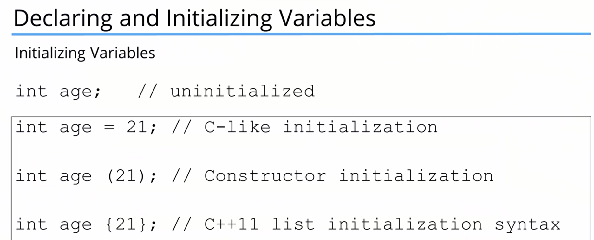
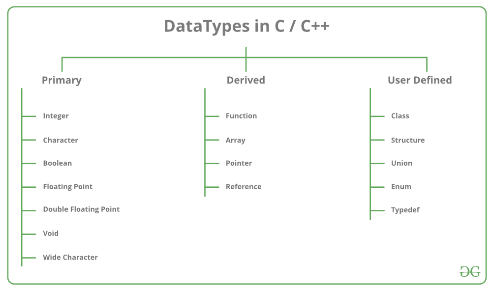
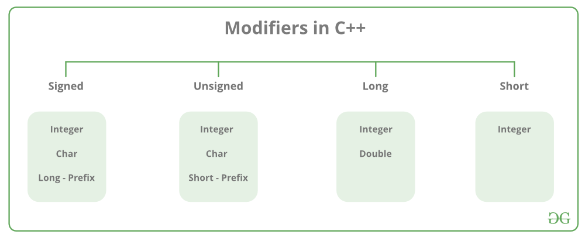

# Variable And Constant

  

  

- A variable is a abstraction for the memory location.
- Allow programmer to use meaningful names and not memory addresses.

- A variable have different type like :
	- Integer
	- float
	- string

- A variable must be declared before it is  used. ( in C++)
- And its value may change.

  



  

---

  

```cpp

[[include]] <iostream>

  

using namespace std;

  

// program to calculate area of rectangle

int main() {

 int length {0}; // Always initilize the variable

 int width {0}; // This is local variable

 cout << "Enter length of rectangle: ";

 cin >> length;

 cout << "Enter width of rectangle: ";

 cin >> width;

 cout << "Area of the rectangle is " << length * width << endl;

 return 0;

}

```

  

> Enter length of rectangle: 13

>

> Enter width of rectangle: 15

>

> Area of the rectangle is 195

  

---

  

```cpp

[[include]] <iostream>

  

using namespace std;

int age{18}; // Global variable

  

int main() {

 cout<< age << endl;

 return 0;

}

```

  

> 18

  

---





  

```cpp

int main() {

 // * Character data types

 char myChar = 'A'; // Single character, use single quotes, double quotes are for strings

 // * Integer data types

 int myInt = 5; // Integer, whole number

 unsigned int myUInt = 5; // Unsigned integer, whole number, positive

 long int myLong = 50000871; // Long, whole number

 long long int myLongLong = 5'000'023'222'871; // Long long, whole number

 short int myShort = 5; // Short, whole number

  

 // * Floating point data types

 float myFloat = 5.5; // Floating point, decimal number

 double myDouble = 5.2135; // Double for larger number, decimal number

 long double myLongDouble = 5.2135; // Long double for very larger number, decimal number

 // * Boolean data types

 bool myBool = true; // Boolean, true or false

 // * Function data types

 void myFunction(); // Function, no return value, no parameters

 return 0;

}

```

  

---

  

**Constants** values cannot change once declared!

  

```cpp

[[include]] <iostream>

  

using std::cout;

using std::endl;

using std::cin;

  

int main()

{

 const double cleaningSmall = 25.0;

 const double cleaningLarge = 35.0;

 const double tax = 0.08;

 cout << "Hello Welcome to the new world carpet cleaning service!" << endl;

 cout << "\nHow many small carpet do you want to clean?" << endl;

 int smallCarpet;

 cin >> smallCarpet;

 cout << "How many large carpets do you want to clean?" << endl;

 int largeCarpet;

 cin >> largeCarpet;

 cout<< endl;

 cout<< "Estimate for carpet cleaning" << endl;

 cout<< "Small carpets: $" << smallCarpet * cleaningSmall << endl;

 cout<< "Large carpets: $" << largeCarpet * cleaningLarge << endl;

 cout<< "Tax: $" << (smallCarpet * cleaningSmall + largeCarpet * cleaningLarge) * tax << endl;

 cout << "========================================" << endl;

 cout<< "Total: $" << (smallCarpet * cleaningSmall + largeCarpet * cleaningLarge) * (1 + tax) << endl;

 cout<< "Thank you for your business!" << endl;

}

```

  

>  ```cpp

>

>How many small carpet do you want to clean?

> 5

> How many large carpets do you want to clean?

> 7

>

>Estimate for carpet cleaning

>  Small carpets: $125

>  Large carpets: $245

>  Tax: $29.6

> ================================

>  Total: $399.6

> Thank you for your business!

> ---

>  ```

  

<hr style="border:2px solid red ;height:0px; background-color:red"> </hr>

